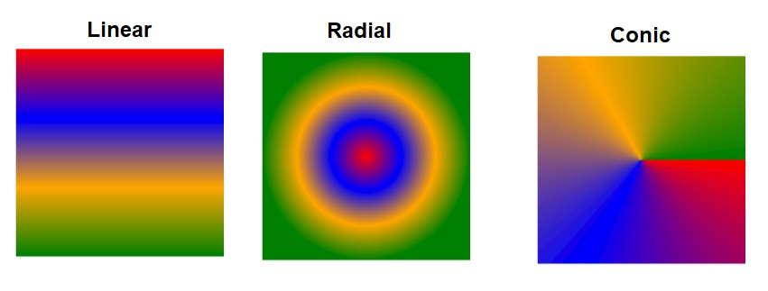

# Gradientview

android: api 21+   
ios : 10.0+   
web: svg 
  
  
  


## Getting started

`$ npm install react-native-gradientview --save`  
`$ react-native link react-native-gradientview`  
  
or

`$ yarn add react-native-gradientview `
    
## Android

**Add Kotlin**

/app/build.gradle 

```gradle
apply plugin: 'kotlin-android' 

android {

   dependencies {
     // From node_modules
    implementation "org.jetbrains.kotlin:kotlin-stdlib-jdk7:$kotlin_version"
  
    }
}

```

/build.gradle

```gradle
buildscript {

        repositories {
            ...
            mavenCentral()
            jcenter()
        }
        ext.kotlin_version = '1.5.21'  //last version
        dependencies {
            classpath "org.jetbrains.kotlin:kotlin-gradle-plugin:$kotlin_version"
        }
    }
}

```

## IOS

**Add Swift**

(If you are using expo sdk >=42 you don't need to do this)

/ios/name_project

add a .swift file 


# Usage
```javascript
import { LinearGradient, RadialGradient,ConicGradient ,Color } from 'react-native-gradientview';

// TODO: What to do with the module?
   <LinearGradient {...props}
     colors={[Color('red'),Color('#ccc'),...]}
    />

    <RadialGradient {...props} />
    <ConicGradient {...props} />


```


## LinearGradient 

| Name | type | OS | default |
| --- | --- | --- | --- |
| startPoint |  Object | android,web,ios | 0.5 - 0 |
| endPoint |  Object | android,web,ios | 0.5 - 1 |
| colors |  Array [Color]  | android,web,ios | white,black |
| positions |  Array [number] | android,web,ios | undefined  |
| tileMode |  String | android,web | 'clamp' |  
## RadialGradient 

| Name | type | OS | default |
| --- | --- | --- | --- |
| startPoint |  Object |ios | 0.5 - 0 |
| endPoint |  Object | ios | 0.5 - 1 |
| colors |  Array [Color]  | android,web,ios | white,black |
| positions |  Array [number] | android,web,ios | undefined |
| centerX |  number | android,web | 0.5 |
| centerY |  number | android,web | 0.5 |
| radius |  Object{ multiplier (android) } | android,web | 0.5 |
| tileMode |  String | android,web | 'clamp' |

## ConicGradient 

| Name | type | OS | default |
| --- | --- | --- | --- |
| startPoint |  Object | ios | 0.5 - 0 |
| endPoint |  Object | ios | 0.5 - 1 |
| colors |  Array [Color]  | android,web,ios | white,black |
| positions |  Array [number] | android,web,ios | undefined |
| centerX |  number | android,web | 0.5 |
| centerY |  number | android,web | 0.5 |
| conicRotation |  number | android,web | 0 |

